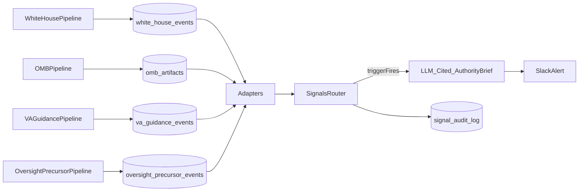

# Authority-Layer Signal Classes (AAR) — Implementation Plan

**Goal:** Close the “authority detection” gap by adding **exactly four** new Signal classes (categories) that surface authoritative state-changes (not comms) and always output:

- **What just became mandatory**
- **Who is now constrained**
- **What downstream behavior is likely to change**

**Hard constraints (from commander):**

- **Exactly 4 new signal classes**, no more.
- **LLM-assisted outputs must include verifiable quotes/citations** from the ingested source text.
- **New dedicated pipelines + new DB tables + new adapters** (do not route these through Oversight Monitor).
- No dashboards; keep scope tight; keep alert volume low.

---

## Where this plugs in (current system reality)

- Signal categories are loaded from `config/signals/<category_id>.yaml` via `src/signals/schema/loader.py`.
- The router currently processes only `hearings`, `bills`, and `om_events` (`src/run_signals.py`). We will extend it to include the new authority tables.

---

## Architecture change (minimal, but explicit)

Key design choices:

- **Acquisition stays separate** (new `run_*` + `fetch_*` pipelines).
- **Routing stays pure** (still YAML + evaluator whitelist).
- **Authority brief generation is only executed for the four new classes**, and is quote-validated.

---

## Update the operational campaign plan (doc adaptation)

Modify [`docs/plans/2026-01-22-operational-design-campaign-plan.md`](/Users/xa/.cursor/worktrees/va-signals-v2/nom/docs/plans/2026-01-22-operational-design-campaign-plan.md) to explicitly add the 3-layer model and the four new signal classes as Phase I “non‑negotiable corrective action”.

Edits to include:

- Add a short subsection: **Intent / Authority / Execution layers** (Authority currently thin; Execution fragmented).
- Under **LOE 1 (Federal Authority Monitoring)** add tasks for **White House enactment/activation** and **OMB execution/budget artifacts**.
- Under **LOE 5 (Command & Control)** add tasks for “4 authority-layer Signal classes + LLM-cited authority briefs”.
- Add cross-agency spillover as an **entity-scope requirement** (DOL/HUD in-scope anchors) without adding a fifth signal class.

---

## The four new Signal classes (YAML categories)

Create exactly these four new files under `config/signals/`:

- `statutory_activation_policy_closure.yaml`
- `omb_execution_budget_constraint.yaml`
- `va_internal_guidance_change.yaml`
- `mandated_oversight_precursor.yaml`

Each category:

- Restricts `authority_source`/`authority_type` via `indicator_condition`.
- Uses strong anti-spam discriminators.
- Uses long suppression cooldowns (days, not minutes) unless the authority_id is inherently unique per change.
- Includes a routing action like `include_authority_brief` so we only invoke the LLM when required.

Category intent (what to match):

- **Statutory Activation / Policy Closure**: bill became law + WH implementation/activation memoranda + delegations to VA/OMB/DOL + statute-triggered required reports.
- **OMB Execution & Budget Constraint**: OMB memoranda/circulars/guidance + any public apportionment/budget execution constraints affecting VA programs.
- **VA Internal Guidance Change**: VBA circulars, VHA directives, M21-1/manual updates, program letters tied to statutory change.
- **Mandated Oversight Precursor**: precursors between enactment and GAO/OIG issuance (data calls, work plan additions, audit openings, pre-review narrative shaping artifacts).

---

## New DB tables (authority event stores)

Modify [`schema.sql`](/Users/xa/.cursor/worktrees/va-signals-v2/nom/schema.sql) to add four new tables, minimally shaped to support:

- deterministic dedupe (stable `event_id`)
- `published_at`
- `title`
- `source_url`
- **raw_text** (or raw_html) sufficient for quote-validation
- `fetched_at`

Also add indexes on `(published_at)` and `(source_url)`.

Update [`src/db.py`](/Users/xa/.cursor/worktrees/va-signals-v2/nom/src/db.py) with CRUD helpers similar to existing patterns (insert, get-by-id, “new since”, etc.).

---

## New acquisition pipelines (fetch + run)

Create four dedicated pipelines:

- White House
  - Create: `src/fetch_white_house.py`, `src/run_white_house.py`
  - Output table: `white_house_events`
  - Filter: Presidential Actions / memoranda / bill signings; exclude speeches/press.

- OMB
  - Create: `src/fetch_omb.py`, `src/run_omb.py`
  - Output table: `omb_artifacts`
  - Filter: memoranda/circulars/guidance; prioritize VA/OMB/DOL/HUD/SSA intersections.

- VA internal guidance
  - Create: `src/fetch_va_guidance.py`, `src/run_va_guidance.py`
  - Output table: `va_guidance_events`
  - Sources: WARMS/M21-1 update surfaces + VHA directive publications (public pages).

- Oversight precursor
  - Create: `src/fetch_oversight_precursors.py`, `src/run_oversight_precursors.py`
  - Output table: `oversight_precursor_events`
  - Sources: publicly posted GAO “ongoing work”/engagement signals + VA OIG work plan / audit announcements.

Each runner should:

- `init_db()`
- write a `source_runs` record (`SUCCESS` / `NO_DATA` / `ERROR`)
- be fail-closed (network/parse errors => `ERROR`)
- store only authority-validated events
- not post Slack directly (Slack comes from Signals routing)

---

## New adapters + routing integration

Create adapters under `src/signals/adapters/`:

- `white_house.py`
- `omb.py`
- `va_guidance.py`
- `oversight_precursors.py`

Update [`src/run_signals.py`](/Users/xa/.cursor/worktrees/va-signals-v2/nom/src/run_signals.py):

- Add `_fetch_unrouted_*` functions for each new table (same “NOT EXISTS in signal_audit_log” pattern).
- Extend `--source` choices to include the new sources.
- Instantiate and use the new adapters.

---

## LLM-cited “authority brief” output

Implement an authority brief generator that is:

- invoked only when `include_authority_brief` is in the routing actions
- **quote-validated**: every quoted string must be a substring of the provided source text
- fail-closed: if the model output can’t be validated, mark brief extraction failed and force `human_review_required`

Proposed files:

- Create: `src/signals/output/authority_brief.py`
- Modify: `src/signals/output/slack.py` to optionally render the 3 required fields (with quotes) into Slack blocks.
- Modify: `src/run_signals.py` `_process_route_result` to compute/pass the brief when required.

Prompt requirements:

- Return JSON only.
- Provide the three outputs plus a short list of verbatim supporting quotes for each.

---

## Tests (TDD, high value only)

Add/extend tests under `tests/signals/`:

- New adapter tests for each new adapter.
- New schema-loader tests to ensure each new YAML loads.
- New routing tests with synthetic envelopes that hit each category.
- Authority brief tests:
  - mocked anthropic client returns JSON with quotes
  - validation rejects hallucinated quotes
  - Slack formatter includes the three required sections.

---

## Verification (before claiming done)

Run:

- `./.venv/bin/python -m pytest tests/signals -v`
- `./.venv/bin/python -m src.run_signals test-envelope`
- One end-to-end dry run once the fetchers exist: `python -m src.run_signals route --dry-run`