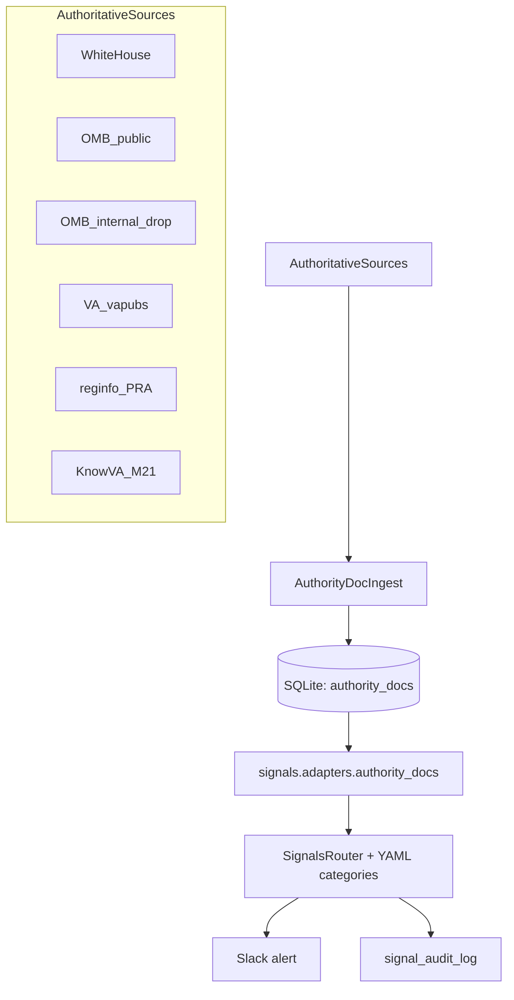

# Authority Layer Signals Upgrade Plan

**Goal:** Eliminate the current “detecting motion vs detecting authority” gap by adding **exactly four** new Signal categories and the minimum upstream ingestion required to feed them, while staying fail‑closed and avoiding alert flood.

## Current posture (what we’re adapting)

- Signals routing loads YAML categories from `config/signals/*.yaml` and currently routes only **hearings / bills / om_events** (see `src/run_signals.py`).
- Slack/audit output is mostly “trigger + matched terms”; it does **not** reliably express authority deltas.
- Approved-source policy (`config/approved_sources.yaml`) is currently FR/eCFR‑only; new authority sources need explicit handling.

## Commander’s required correction (authoritative events)

Implement **four** new Signal categories (YAML schemas) with deterministic outputs:

1. **Statutory Activation / Policy Closure**
2. **OMB Execution & Budget Constraint**
3. **VA Internal Guidance Change**
4. **Mandated Oversight Precursor**

Each fired trigger must include:

- **What just became mandatory**
- **Who is now constrained**
- **What downstream behavior is likely to change**

No dashboards; no new “classes” beyond these four.

## Architecture change (minimal, authority-first)

Add a dedicated “authority-layer event store” so the router can treat these as **state changes**.

## Implementation plan

### Task 1: Update operational design campaign plan (docs)

- Modify [`docs/plans/2026-01-22-operational-design-campaign-plan.md`](docs/plans/2026-01-22-operational-design-campaign-plan.md):
  - Make the **3-layer model** explicit (Intent / Authority / Execution) and mark current weakness as Authority+Execution.
  - Under **LOE 1 (Federal Authority Monitoring)** add the missing authoritative channels:
    - White House enactment/activation artifacts
    - OMB execution/budget constraint artifacts
    - VA internal directives/handbooks/notices (below rulemaking)
  - Under **LOE 2 (Oversight Intelligence)** add “Mandated Oversight Precursor” as an early-warning lane.
  - Add a tight success criterion: **no missed White House signing/enactment events affecting VA + no missed OMB constraint artifacts delivered to the drop folder**.

### Task 2: Add `authority_docs` store to SQLite

- Modify `schema.sql`:
  - Add table `authority_docs` with:
    - `doc_id` (TEXT PRIMARY KEY) – composite to prevent collisions (e.g., `whitehouse:post:<id_or_slug>`, `omb:memo:M-26-01`, `va:vapubs:directive:0001`, `omb:apportionment:<sha>`, `reginfo:pra:<ref_nbr>`, `knowva:m21:<change_id>`)
    - `authority_source`, `authority_type`
    - `title`, `published_at`, `source_url`
    - `body_text` (normalized text for matching), `content_hash`, `version`
    - `metadata_json`, `fetched_at`, `first_seen_at`, `updated_at`
  - Add indexes on `(authority_source, published_at)` and `(content_hash)`.
- Modify `src/db.py`:
  - Add helpers: `upsert_authority_doc(...)`, `fetch_unrouted_authority_docs(limit)`.

### Task 3: Implement authority-layer ingestion runners (fail-closed)

Create `src/run_authority_docs.py` (new) that:

- Records `source_runs` with `source_id="authority_docs"`.
- Calls sub-ingestors; aggregates errors; **never fabricates**.

Sub-ingestors (new modules under `src/`):

- **White House** (`src/fetch_whitehouse.py`)
  - Fetch list pages (HTML):
    - `https://www.whitehouse.gov/briefing-room/statements-releases/` (captures bill signings like H.R. 1823)
    - `https://www.whitehouse.gov/presidential-actions/` (E.O.s, memoranda, etc.)
  - Parse links/titles/dates; fetch detail pages; extract main text with BeautifulSoup.
  - Store as `authority_source="whitehouse"` and `authority_type` derived from section/category/title (e.g., `bill_signing`, `executive_order`, `presidential_memorandum`).

- **OMB public guidance** (`src/fetch_omb_guidance.py`)
  - Fetch `https://www.whitehouse.gov/omb/information-resources/guidance/memoranda/`.
  - Parse memo IDs (e.g., `M-26-01`), titles, dates, PDF links.
  - Download PDFs; extract text (use existing `playwright` only if needed; otherwise add `pypdf` for text extraction).
  - Store as `authority_source="omb"`, `authority_type="memorandum"`.

- **OMB internal apportionment/budget artifacts (local drop)** (`src/fetch_omb_internal_drop.py`)
  - Scan `data/omb_apportionments/` for new/changed files.
  - For each file: compute hash, extract text (PDF/HTML), store `authority_source="omb"`, `authority_type="apportionment"`, `source_url` as a repo-relative path.

- **VA internal policy instruments (below FR threshold)** (`src/fetch_va_pubs.py`)
  - Scrape VA Publications search results (`https://www.va.gov/vapubs/search_action.cfm?...`) for **Directives / Handbooks / Notices / Delegations**.
  - Fetch per-publication pages (`viewPublication.asp?...`) and extract text + issue date.
  - Store as `authority_source="va"` and `authority_type` mapped by doc type.

- **Mandated-report precursors via OMB PRA (reginfo.gov)** (`src/fetch_reginfo_pra.py`)
  - Scrape `https://www.reginfo.gov/public/do/PRASearch` for VA agency submissions.
  - For each new `ref_nbr`, fetch `PRAViewICR` / `PRAICList` pages, extract title, stage, dates, and any statute mentions.
  - Store as `authority_source="omb_oira"`, `authority_type="pra_icr"`.

- **KnowVA M21-1 changes (Playwright)** (`src/fetch_knowva_m21.py`)
  - Use `playwright.sync_api` (pattern already used in `src/state/sources/ca_official.py`) to load the M21-1 “Changes by Date” UI and extract the rendered list.
  - Persist only the change list items (date, section, short description, link target) as `authority_docs` rows.
  - Fail closed: if blocked/login required, emit `ERROR` and do not guess.

### Task 4: Wire authority_docs into Signals routing

- Create `src/signals/adapters/authority_docs.py` to convert `authority_docs` rows → `Envelope`.
- Modify `src/signals/adapters/__init__.py` to export the new adapter.
- Modify `src/run_signals.py`:
  - Add a `_fetch_unrouted_authority_docs()` and routing loop (parallel to hearings/bills/om_events).

### Task 5: Add the four new Signal category YAMLs (only these four)

Create these new files under `config/signals/`:

- `statutory_activation_policy_closure.yaml`
- `omb_execution_budget_constraint.yaml`
- `va_internal_guidance_change.yaml`
- `mandated_oversight_precursor.yaml`

Design rules (to prevent flood):

- Each category must have a tight `indicator_condition` on `authority_source` + `authority_type`.
- Each trigger must include an **anti-spam discriminator** node (as used in `config/signals/oversight_accountability.yaml`).
- Use **suppression** with long cooldowns for high-volume sources; keep `version_aware: true`.

### Task 6: Make outputs authority-forward (required 3 bullets)

- Extend routing rules (YAML) to include a deterministic `authority_effects` block per trigger:
  - `what_just_became_mandatory: [...]`
  - `who_is_now_constrained: [...]`
  - `downstream_behavior_change: [...]`
- Modify:
  - `src/signals/router.py` / `RouteResult` to carry these fields through.
  - `src/signals/output/audit_log.py` to include them in `explanation_json`.
  - `src/signals/output/slack.py` to render them as three bullet sections.

### Task 7: Tests (prevent regression + prove gating)

Add/extend tests under `tests/signals/`:

- Parser tests for each ingestor (store HTML fixtures for White House list/detail, OMB memos page, VA vapubs search results, reginfo pages).
- Router tests:
  - Provide synthetic `Envelope`s with `authority_source="whitehouse"|"omb"|"va"|"omb_oira"` and assert the new YAML triggers fire.
- Slack formatter test update to assert the three required bullets appear in blocks.

### Task 8: Ops entrypoints

- Update `Makefile`:
  - Add `authority-docs:` → `python -m src.run_authority_docs`
  - Add `signals:` → `python -m src.run_signals route`
- Add a short README section in `README.md` describing the new daily order: `authority-docs` → `signals`.

## Acceptance criteria

- Exactly four new YAML categories exist (no more).
- A bill signing (e.g., White House “Signed into Law” post) produces an alert that explicitly states:
  - what became mandatory
  - who is constrained
  - likely downstream behavior change
- OMB apportionment PDFs dropped into `data/omb_apportionments/` are ingested and routed.
- Tests pass: `make test`.