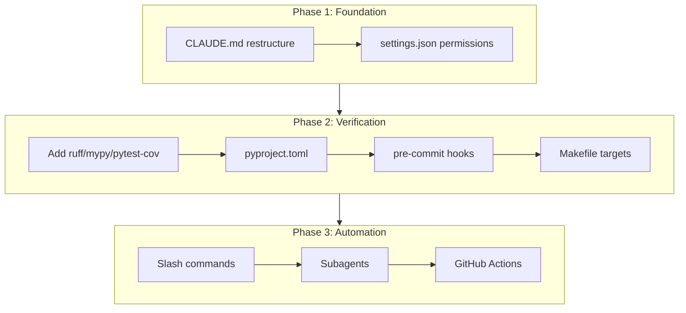

# Boris Claude Code Workflow Operationalization

## Current State

| Component | Status | Gap |

|-----------|--------|-----|

| [CLAUDE.md](CLAUDE.md) | ~1.5k tokens | Missing tech stack, conventions, expanded anti-patterns |

| [.claude/settings.json](.claude/settings.json) | Has PostToolUse hook | Missing permissions (allowed/ask/denied) |

| Slash commands | None | Need inner-loop workflows |

| Subagents | None | Need verification/refactor/build agents |

| Linters/formatters | None | Need ruff, mypy, pre-commit |

| GitHub Actions | Only daily FR delta | Need PR review workflow |

| Test coverage | Not measured | Need pytest-cov |

---

## Phase 1: CLAUDE.md Restructure (~2.5k tokens target)

Expand [CLAUDE.md](CLAUDE.md) to match Boris's recommended structure:

```markdown
# Additions needed:

## Tech Stack (NEW)
- Python 3.11+
- SQLite (data/signals.db)
- Key deps: requests, bs4, playwright, anthropic, fastapi

## Code Conventions (NEW)
- PEP 8 + ruff formatting
- Type hints on public functions
- Docstrings: Google style
- Test naming: test_<module>_<scenario>

## Things NOT To Do (EXPAND existing Non-Negotiables)
- Never mock the database in tests (use conftest.py fixture)
- Never commit .env files or hardcode API keys
- Never skip provenance checks
- Never use print() for logging (use logging module)
- Never create new tables without updating schema.sql
- Never push directly to main
```

---

## Phase 2: Permissions Configuration

Update [.claude/settings.json](.claude/settings.json) to add command permissions:

```json
{
  "permissions": {
    "allow": [
      "make test",
      "make lint",
      "make format",
      "python -m pytest",
      "ruff check",
      "ruff format",
      "git status",
      "git diff",
      "git log"
    ],
    "ask": [
      "git commit",
      "git push",
      "make db-init",
      "rm -rf",
      "pip install"
    ],
    "deny": [
      "git push --force",
      "git reset --hard",
      "rm -rf /",
      "DROP TABLE",
      "sudo"
    ]
  }
}
```

---

## Phase 3: Slash Commands

Create `.claude/commands/` directory with inner-loop workflows:

| Command | File | Purpose |

|---------|------|---------|

| `/pr` | `pr.md` | Create PR with conventional commit message |

| `/test` | `test.md` | Run tests with coverage, report failures |

| `/verify` | `verify.md` | Full verification (lint + type + test) |

| `/review` | `review.md` | Self-review checklist before committing |

| `/signal` | `signal.md` | Add new signal category YAML with validation |

Example `/verify` command:

```markdown
# .claude/commands/verify.md
Run full verification suite:
1. Run `ruff check .` and fix any errors
2. Run `ruff format --check .` and fix formatting
3. Run `mypy src/` and address type errors
4. Run `pytest --cov=src --cov-fail-under=70`
5. Report summary of all checks
```

---

## Phase 4: Subagents

Create `.claude/subagents/` directory with specialized agents:

| Subagent | File | Purpose |

|----------|------|---------|

| `architect` | `architect.md` | Verify architecture decisions, check module boundaries |

| `refactor` | `refactor.md` | Refactor code while preserving behavior (TDD) |

| `validator` | `validator.md` | Validate builds, check imports, verify schema |

| `reviewer` | `reviewer.md` | Code review with security/performance focus |

Example `architect` subagent:

```markdown
# .claude/subagents/architect.md
You are an architecture verification agent. Your role:

1. Check that new code follows existing patterns:
   - Fetch modules don't write to DB directly
   - Runners log to source_runs table
   - Adapters normalize to Envelope format

2. Verify module boundaries:
   - src/oversight/ is self-contained
   - src/signals/ doesn't import from src/state/
   - src/db.py is the only DB access point

3. Flag violations with specific file:line references
```

---

## Phase 5: Verification Infrastructure

### 5.1 Add dependencies to [requirements.txt](requirements.txt)

```
ruff>=0.4.0
mypy>=1.10.0
pytest-cov>=5.0.0
pre-commit>=3.7.0
```

### 5.2 Create `pyproject.toml` for tool configuration

```toml
[tool.ruff]
line-length = 100
target-version = "py311"
select = ["E", "F", "I", "UP", "B", "SIM"]

[tool.mypy]
python_version = "3.11"
warn_return_any = true
ignore_missing_imports = true

[tool.pytest.ini_options]
testpaths = ["tests"]
addopts = "-q --tb=short"

[tool.coverage.run]
source = ["src"]
omit = ["src/dashboard/*"]
```

### 5.3 Create `.pre-commit-config.yaml`

```yaml
repos:
  - repo: https://github.com/astral-sh/ruff-pre-commit
    rev: v0.4.0
    hooks:
      - id: ruff
        args: [--fix]
      - id: ruff-format
  - repo: https://github.com/pre-commit/mirrors-mypy
    rev: v1.10.0
    hooks:
      - id: mypy
        additional_dependencies: []
```

### 5.4 Add Makefile targets

```makefile
lint:
	ruff check .

format:
	ruff format .

type-check:
	mypy src/

test-coverage:
	pytest --cov=src --cov-report=term-missing

verify: lint type-check test-coverage
	@echo "All checks passed"
```

---

## Phase 6: GitHub Actions

### 6.1 Create `.github/workflows/pr-checks.yml`

```yaml
name: PR Checks
on: [pull_request]

jobs:
  verify:
    runs-on: ubuntu-latest
    steps:
      - uses: actions/checkout@v4
      - uses: actions/setup-python@v5
        with:
          python-version: "3.11"
      - run: pip install -r requirements.txt
      - run: ruff check .
      - run: ruff format --check .
      - run: mypy src/
      - run: pytest --cov=src --cov-fail-under=60
```

### 6.2 Create `.github/workflows/claude-review.yml` (optional)

For Claude bot PR reviews using `@anthropic/claude-code-action`:

```yaml
name: Claude Review
on:
  issue_comment:
    types: [created]

jobs:
  review:
    if: contains(github.event.comment.body, '@claude')
    runs-on: ubuntu-latest
    steps:
      - uses: anthropics/claude-code-action@v1
        with:
          anthropic_api_key: ${{ secrets.ANTHROPIC_API_KEY }}
```

---

## Phase 7: Parallel Sessions Workflow Documentation

Add to CLAUDE.md:

```markdown
## Parallel Session Workflow

Boris's approach to running 5 Claude Code sessions:

1. **Tab Numbering**: Rename terminal tabs (1-5) for notification context
2. **Plan Mode First**: Use plan mode to verify approach before execution
3. **Auto-Accept Edits**: After plan verified, use auto-accept (not dangerously skip)
4. **Background Tasks**: Use `Shift+Esc` to background long-running tasks
5. **Teleport**: Use `/teleport` to bring cloud sessions to local terminal

### Session Allocation Example
- Tab 1: Main feature implementation
- Tab 2: Tests for feature
- Tab 3: Documentation updates
- Tab 4: Bug fixes / hotfixes
- Tab 5: Exploratory / architecture review
```

---

## Implementation Order



---

## Files to Create/Modify

| Action | File |

|--------|------|

| Modify | `CLAUDE.md` |

| Modify | `.claude/settings.json` |

| Create | `.claude/commands/pr.md` |

| Create | `.claude/commands/test.md` |

| Create | `.claude/commands/verify.md` |

| Create | `.claude/commands/review.md` |

| Create | `.claude/commands/signal.md` |

| Create | `.claude/subagents/architect.md` |

| Create | `.claude/subagents/refactor.md` |

| Create | `.claude/subagents/validator.md` |

| Create | `.claude/subagents/reviewer.md` |

| Modify | `requirements.txt` |

| Create | `pyproject.toml` |

| Create | `.pre-commit-config.yaml` |

| Modify | `Makefile` |

| Create | `.github/workflows/pr-checks.yml` |

| Create | `.github/workflows/claude-review.yml` |